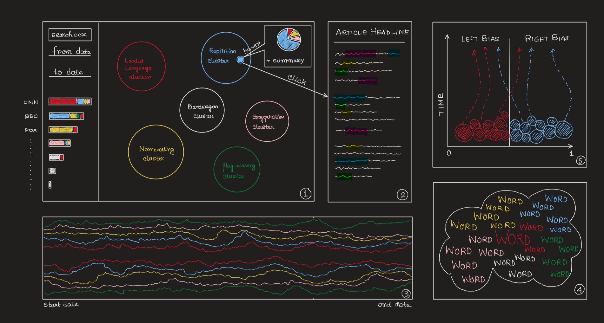
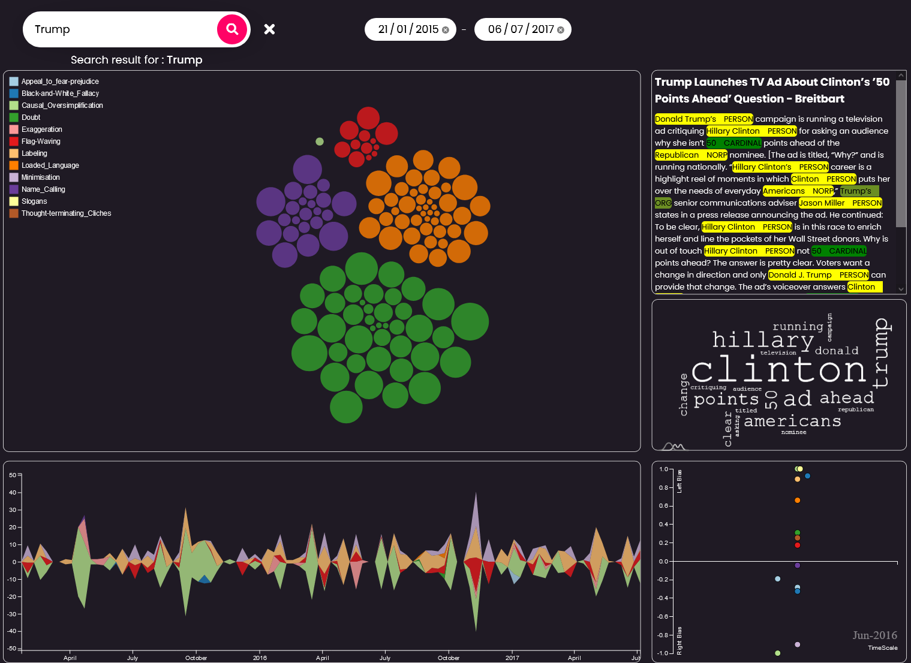

## Web tool for analysis of Newspaper Propaganda Biases

This is a full stack web system which visualizes newspaper biases on the basis of propaganda techniques using PRTA API. This was built as part of the course project for Data Visualization where I was the lead frontend developer for the project. The system is an umbrella containing two applications, a JavaScript frontend powered by d3.js and a flask backend.

### How to run

To setup the backend server, the following python packages need to be installed in your system:<br/>

-   flask
-   flask-cors
-   numpy
-   pandas
-   scikit-learn
-   scipy
-   spacy
-   nltk

Spacy and NLTK require further packages which can be installed by running

```sh
python -m spacy install en_core_web_sm
python -m nltk install stopwords
```

To run BE, run

```sh
flask run
```

The backend abstracts the following APIs

-   /<search_criteria>
-   /article/<article_id>

The JS frontend can be hosted on a simple live server. We recommend a VS code live server or a live python http server using

```sh
python3 -m http.server [PORT NUMBER]
```

### Preview

<br><br>
<br><br>


### Support Development
 
[](https://www.paypal.me/sdnitrogen)
